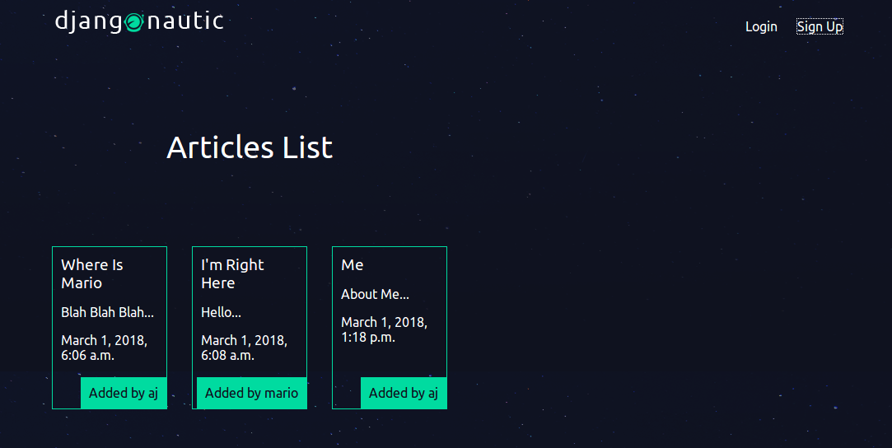

# Djangonautic
A blog website created using django



### How to run the application
1. Clone the repository
```
$ git clone https://github.com/Aj163/Djangonautic.git
```
2. Change directory
```
$ cd djangonautic
```
3. Run the server
```
$ python manage.py runserver
``` 

### Requirements
- django 2.x
- python 3.x
